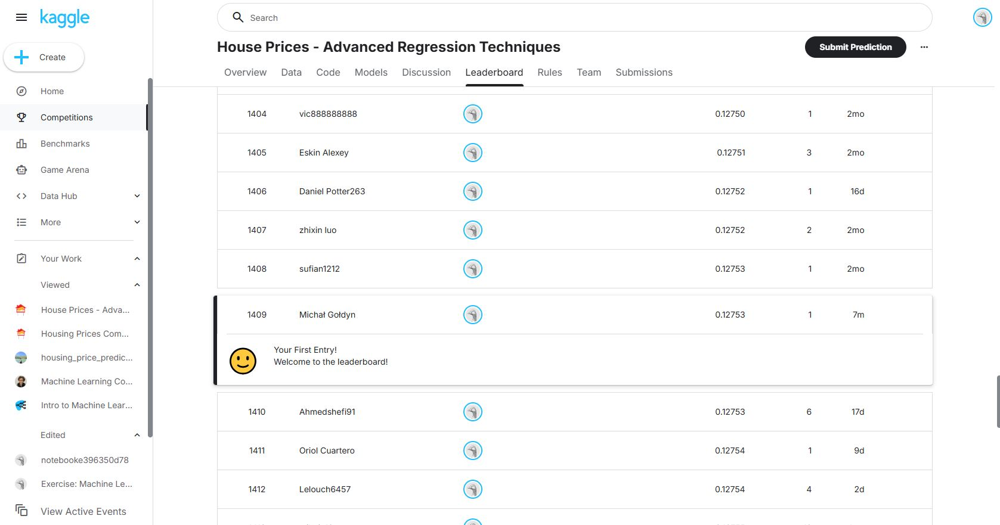
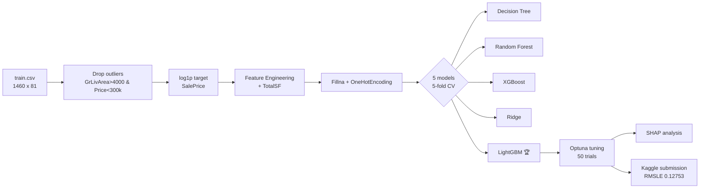
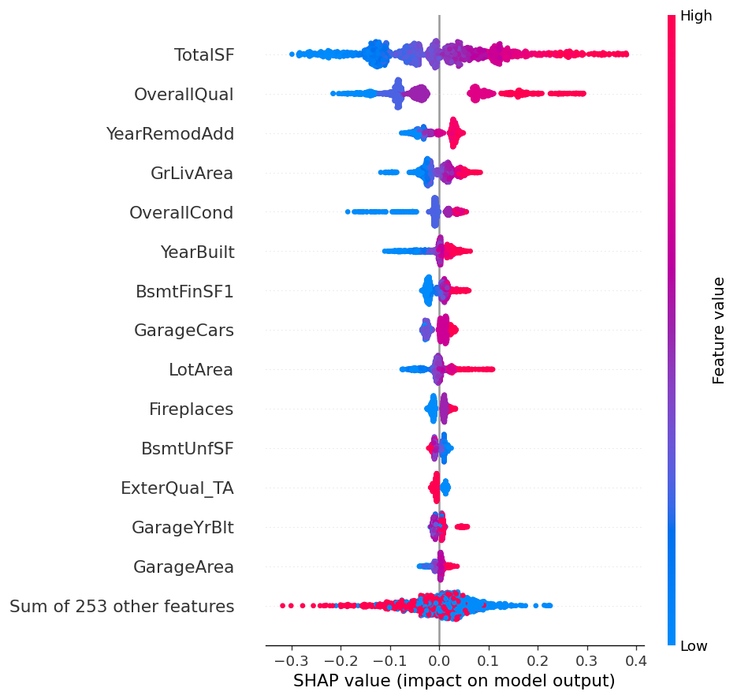

# House Prices: Advanced Regression Techniques

ML pipeline predicting Ames (Iowa, USA) housing prices using LightGBM + Optuna tuning.
Top 27.5% on Kaggle public leaderboard.

**Kaggle RMSLE: 0.12753** | **Position: 1409 / 5119 teams**



## Pipeline



## Results

Iteration progress on 5-fold cross-validation RMSE:
| Stage | Model | CV RMSE | Improvement |
|-------|-------|---------|-------------|
| Baseline | Ridge | 0.1299 | — |
| + Feature Engineering | Ridge + TotalSF | 0.1289 | -0.001 |
| Model comparison | LightGBM (default) | 0.1282 | -0.0007 |
| **Hyperparameter tuning** | **LightGBM + Optuna** | **0.1190** | **-0.0092** |


### SHAP feature importance (top 5)

| # | Feature | Mean abs SHAP |
|---|---------|---------------|
| 1 | **TotalSF** (engineered) | 0.110 |
| 2 | OverallQual | 0.096 |
| 3 | YearRemodAdd | 0.032 |
| 4 | GrLivArea | 0.027 |
| 5 | OverallCond | 0.022 |




## Key findings

1. SalePrice is right-skewed (skewness = 1.88). Training on `log1p(SalePrice)` reduces skewness to 0.12, also it aligns with Kaggle RMSLE metric

2. Verified `data_description.txt` and code. 81 rows with NaN values in Garage columns mean "no garage", not really missing data. Changing it to "None" instead of mode/median helps to preserve that data

3. Linear feature engineering doesn't help linear models. Adding `TotalSF` (sum of 3 area columns) didn't change Ridge results. But tree-based models benefit from that

4. Optuna gave the biggest single improvement. Hyperparameter tuning dropped RMSE by -0.0092 vs default LightGBM

5. `TotalSF` (from feature engineering) has highest importance according to SHAP (mean absolute SHAP of 0.110), compared to best original feature OverallQual (0.096)
So total square footage matters more than individual floors and this data directly improves model performance


## Project structure

```
house_prices/
    data/                          # gitignored
        raw/                       # train.csv, test.csv, data_description.txt
        processed/                 # submission.csv
    notebooks/
        01_eda.ipynb              # Exploratory analysis
        02_baseline.ipynb         # Decision Tree, Random Forest, Ridge baselines
        03_feature_engineering.ipynb
        04_modeling.ipynb         # 4 models + Optuna tuning
        05_final.ipynb            # SHAP + Kaggle submission
    reports/
        figures/                   # 6 plots saved as PNG
        experiments.md             # Experiments log
    requirements.txt
    README.md
```

## Stack

- **Python 3.11** with `venv`
- **Data:** pandas, numpy
- **ML:** scikit-learn, XGBoost, LightGBM
- **Tuning:** Optuna (Bayesian optimization)
- **Interpretability:** SHAP
- **Visualization:** matplotlib, seaborn


## Usage

```bash
# Setup
python -m venv venv
.\venv\Scripts\Activate.ps1
pip install -r requirements.txt

# Download dataset
kaggle competitions download -c house-prices-advanced-regression-techniques -p data/raw/
Expand-Archive data/raw/*.zip -DestinationPath data/raw/

# Run notebooks
jupyter notebook notebooks/
```