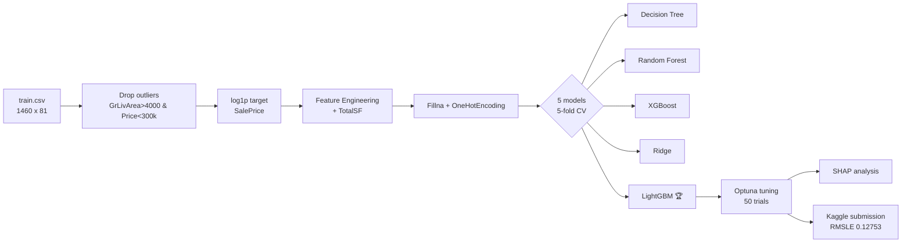

# House Prices: Advanced Regression Techniques

ML pipeline predicting Ames (Iowa, USA) housing prices using LightGBM + Optuna tuning.
Top 27.5% on Kaggle public leaderboard.

🏆 **Kaggle RMSLE: 0.12753** | **Position: 1409 / 5119 teams**

## Pipeline

